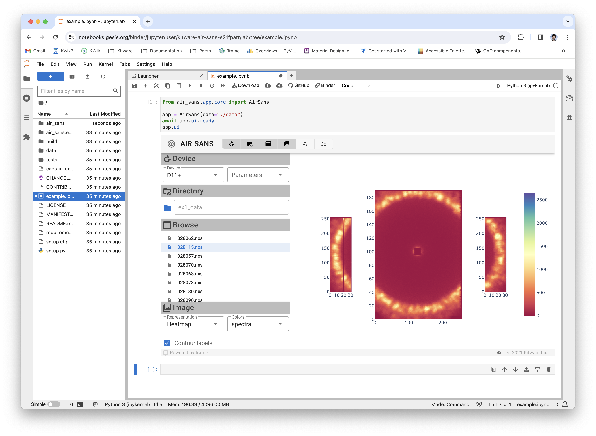

========
air-sans
========

A trame application for analysis, inspection, and reduction of multi-detector data produced by the Small-Angle Neutron Scattering (SANS) instruments.

License
----------

Apache Software License

Installing
----------

Install the application

.. code-block:: console

    pip install air-sans

Run the application

.. code-block:: console

    air-sans --data ./data

Binder usage
------------

`Test it with Binder <https://mybinder.org/v2/gh/Kitware/air-sans/HEAD>`_